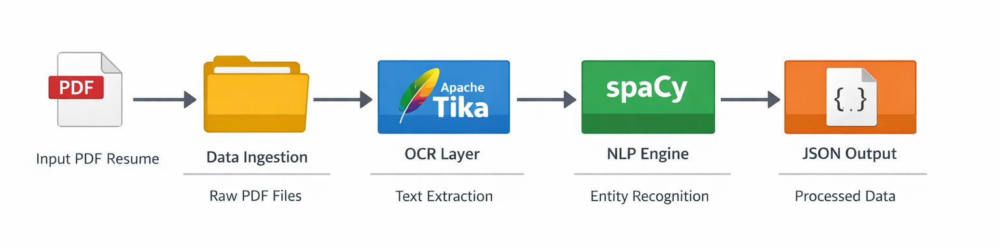

# AI-Powered Resume Parser Pipeline 🌟

## Overview

Dự án này xây dựng một **hệ thống trích xuất thông tin tự động từ CV (Resumes)** dựa trên kỹ thuật **Named Entity Recognition (NER)**. Hệ thống cho phép chuyển đổi dữ liệu **phi cấu trúc (PDF)** sang **JSON có cấu trúc**, phục vụ cho:

* Các bài toán **Data Science / Machine Learning**
* Xây dựng **Data Lake / Data Warehouse**
* Tích hợp vào hệ thống **ATS (Applicant Tracking System)**

---

## System Architecture & Pipeline

Hệ thống được thiết kế theo mô hình **Modular Pipeline**, đảm bảo **tính linh hoạt**, **khả năng mở rộng** và **dễ bảo trì**.



### Pipeline Flow

| Stage | Module               | Description                                                          |
| ----- | -------------------- | -------------------------------------------------------------------- |
| 1     | **Data Ingestion**   | Tiếp nhận file PDF thô từ thư mục `data/raw/`                        |
| 2     | **OCR Layer**        | Sử dụng **Apache Tika Engine** để trích xuất văn bản từ PDF phức tạp |
| 3     | **NLP Engine**       | **SpaCy Custom NER Model** bóc tách các thực thể quan trọng          |
| 4     | **Data Persistence** | Chuẩn hóa & lưu kết quả dưới dạng JSON tại `data/processed/`         |

---

## Project Structure

```
resume-parser/
├── data/
│   ├── raw/                # CV PDF đầu vào
│   ├── processed/          # Output JSON
│   └── annotations/        # Dữ liệu gán nhãn NER
├── src/
│   ├── ocr/                # Apache Tika wrapper
│   ├── nlp/                # SpaCy NER pipeline
│   └── utils/              # Helper functions
├── models/                 # NER trained models
├── docs/
│   └── images/             # Diagram & illustrations
├── Dockerfile
├── requirements.txt
└── README.md
```

---

## Model Evaluation

Sau quá trình **Data Cleaning**, xử lý lỗi gán nhãn thực thể (**SpaCy E024**) và huấn luyện lại mô hình, kết quả **Baseline Evaluation** đạt được như sau:

### 🔎 NER Performance Metrics

| Entity Label           | Precision | Recall   | F1-Score |
| ---------------------- | --------- | -------- | -------- |
| Name                   | 0.85      | 0.78     | 0.81     |
| Skills                 | 0.72      | 0.65     | 0.68     |
| College Name           | 0.88      | 0.82     | 0.85     |
| Degree                 | 0.80      | 0.75     | 0.77     |
| **Overall (Weighted)** | **0.55**  | **0.48** | **0.51** |

> **Note**
>
> * Đánh giá trên **174 CV samples**
> * Mô hình hoạt động tốt với các trường thông tin cố định
> * Hiệu năng giảm khi CV có **layout chia cột (2-column layout)**

---

## 🛠 Tech Stack

| Layer                | Technology                   |
| -------------------- | ---------------------------- |
| Programming Language | **Python 3.10**              |
| NLP Framework        | **SpaCy v3.7 (Custom NER)**  |
| OCR Engine           | **Apache Tika (Java-based)** |
| Containerization     | **Docker**                   |
| Cloud Ready          | **AWS S3, Lambda, Textract** |

---

## Installation & Usage

### 1️Prerequisites

* Docker Desktop (Windows / macOS / Linux)
* RAM ≥ 8GB (khuyến nghị khi train NER)

---

### 2️⃣ Build Docker Image

```bash
docker build -t resume-parser-app .
```

---

### 3️⃣ Run Container (Mount Data)

Mount thư mục dữ liệu từ máy vật lý vào container:

```bash
docker run --name my-parser \
  -v "D:/Resume Parser_NLP/data:/app/data" \
  resume-parser-app
```

📌 **Output** sẽ được sinh tự động tại:

```
data/processed/*.json
```

---

## 📤 Output Sample (JSON)

```json
{
  "name": "Nguyen Van A",
  "skills": ["Python", "SQL", "Machine Learning"],
  "degree": "Bachelor of Computer Science",
  "college": "Ho Chi Minh University of Technology"
}
```

---

## 📈 Future Roadmap

### 🔮 Planned Improvements

* **Advanced OCR**:
  Tích hợp **AWS Textract** để xử lý hoàn hảo CV dạng **2-column / complex layout**

* **Transformer-based NER**:
  Thử nghiệm **BERT / RoBERTa / LayoutLM** để nâng cao hiểu biết ngữ cảnh

* **Cloud Deployment**:
  Triển khai **Serverless Pipeline trên AWS** cho xử lý CV thời gian thực

* **ATS Integration**:
  Cung cấp REST API để tích hợp trực tiếp vào hệ thống tuyển dụng

---

